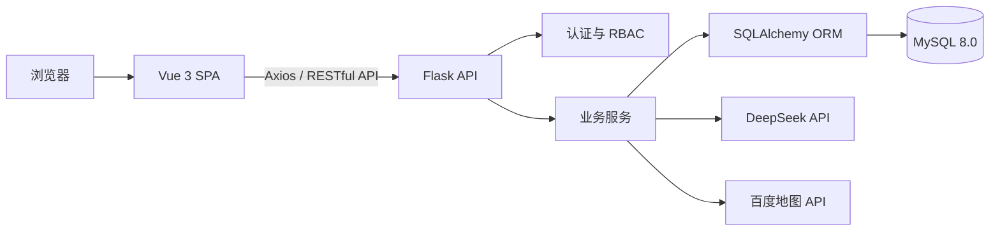

# 智慧图书管理系统

面向高校图书馆场景的前后端分离信息化应用。系统围绕图书借阅、自习室预约和多角色管理等业务展开，提供学生、教师与管理员三类角色入口，并扩展了数据统计、通知、图书荐购、座位报修和智能图书推荐等功能。

> 本项目为个人学习与实践项目，用于展示 Vue、Flask、RESTful API、关系型数据库建模和权限控制等软件开发能力。当前配置以本地开发演示为目标，公网部署前请完成安全加固。

## 功能概览

### 学生与教师端

- 用户注册、验证码登录、个人资料与密码管理
- 图书检索、借阅申请、续借、归还进度查询
- 自习室座位查询、预约、签到与取消预约
- 通知查看、图书荐购、座位报修
- DeepSeek 智能问答与基于借阅记录的图书推荐
- 图书馆位置与周边信息展示

### 管理端

- 用户状态与角色管理
- 图书、分类及库存管理，支持 Excel 导入导出
- 借阅与归还审核
- 座位、预约和报修流程管理
- 系统广播与通知管理
- 用户增长、借阅趋势、分类分布和座位使用率等数据看板

## 技术栈

| 层级 | 技术 |
| --- | --- |
| 前端 | Vue 3、Vue Router、Pinia、Element Plus、Axios、ECharts、Vite |
| 后端 | Python、Flask、Flask-CORS、Flask-SQLAlchemy、PyJWT |
| 数据库 | MySQL 8.0、PyMySQL、SQLAlchemy ORM |
| 外部服务 | DeepSeek API、百度地图 API |
| 工程工具 | Git、npm、Python virtualenv |

## 系统架构



后端按 API、Service、Model 等职责组织代码，通过 Flask Blueprint 拆分业务模块；前端使用 Vue Router 管理路由、Pinia 管理用户状态，并通过 Axios 拦截器统一附加 JWT 和处理接口错误。

## 目录结构

```text
.
├─ backend/
│  ├─ api/             # RESTful API 与 Blueprint
│  ├─ models/          # SQLAlchemy 数据模型
│  ├─ services/        # 业务服务与外部能力封装
│  ├─ utils/           # JWT、验证码、响应等工具
│  ├─ app.py           # Flask 应用入口
│  ├─ config.py        # 环境与业务配置
│  ├─ init_db.py       # 建表与本地演示数据初始化
│  └─ requirements.txt
├─ frontend/
│  ├─ src/api/         # Axios 请求封装
│  ├─ src/router/      # 路由与访问控制
│  ├─ src/store/       # Pinia 状态管理
│  ├─ src/views/       # 学生、教师与管理端页面
│  └─ package.json
└─ .env.example        # 环境变量示例，不包含真实凭据
```

## 本地运行

### 1. 环境要求

- Python 3.10+
- Node.js 20.19+ 或 22.12+
- MySQL 8.0+

### 2. 克隆项目

```bash
git clone https://github.com/3035491776/zzfs.git
cd zzfs
```

### 3. 创建数据库

```sql
CREATE DATABASE smart_library
  CHARACTER SET utf8mb4
  COLLATE utf8mb4_unicode_ci;
```

### 4. 配置环境变量

参考根目录的 `.env.example` 设置本地环境变量。不要将真实配置写入代码或提交到 Git。

PowerShell 示例：

```powershell
$env:SECRET_KEY = "请替换为随机字符串"
$env:JWT_SECRET_KEY = "请替换为另一段随机字符串"
$env:DB_USER = "root"
$env:DB_PASS = "你的 MySQL 密码"
$env:DB_HOST = "127.0.0.1"
$env:DB_PORT = "3306"
$env:DB_NAME = "smart_library"
$env:DEEPSEEK_API_KEY = "你的 DeepSeek API Key"
$env:BAIDU_MAP_AK = "你的百度地图 AK"
```

其中 DeepSeek 和百度地图配置用于对应扩展功能；不使用这些功能时可以留空。`SECRET_KEY` 与 `JWT_SECRET_KEY` 在公网环境中必须替换为足够长且互不相同的随机值。

### 5. 启动后端

```powershell
cd backend
python -m venv .venv
.\.venv\Scripts\Activate.ps1
pip install -r requirements.txt
python init_db.py
python app.py
```

后端默认地址：`http://127.0.0.1:5000`

健康检查：`http://127.0.0.1:5000/api/health`

`init_db.py` 会创建本地演示数据和测试账号。这些账号仅用于本机功能验证；如果将系统部署到可被他人访问的环境，请立即修改或删除所有默认账号。

### 6. 启动前端

新开一个终端：

```powershell
cd frontend
npm install
npm run dev
```

前端默认地址：`http://127.0.0.1:5173`。Vite 会把 `/api` 请求代理到本地 Flask 服务。

## 主要 API 模块

| 模块 | 路径示例 | 说明 |
| --- | --- | --- |
| 认证 | `/api/auth` | 登录、注册、验证码和当前用户 |
| 图书与分类 | `/api/books`、`/api/categories` | 检索、维护、分类与软删除 |
| 借阅 | `/api/borrows` | 申请、审核、归还和续借 |
| 座位预约 | `/api/seats`、`/api/reservations` | 时段查询、预约、签到和取消 |
| 通知与广播 | `/api/notifications`、`/api/broadcast` | 站内通知与系统广播 |
| 数据看板 | `/api/dashboard` | 借阅、分类、用户和座位统计 |
| 智能能力 | `/api/ai` | 对话、流式响应和图书推荐 |
| 数据交换 | `/api/excel` | 图书导入与数据导出 |

## 业务规则示例

- 单个用户最多同时借阅 5 本图书
- 每条借阅记录最多续借 2 次
- 自习室座位最多提前 7 天预约
- 签到设置 30 分钟宽限时间
- 每月未签到次数达到上限后限制继续预约

这些规则集中在后端配置与服务逻辑中，便于后续按实际业务要求调整。

## 安全说明

- 仓库只提供 `.env.example`，真实 `.env` 已由 `.gitignore` 排除。
- 请勿提交 DeepSeek API Key、百度地图 AK、数据库密码、JWT 密钥或其他凭据。
- 当前代码中的默认签名字符串和调试配置仅适合本地开发，公网部署前必须替换并关闭调试模式。
- 初始化脚本包含本地演示账号；公网部署时应删除默认账号、使用强密码，并限制管理接口访问。
- 如果任何真实密钥曾经被提交，即使后来删除文件，也应立即在对应服务端撤销并重新生成密钥。

## 后续改进方向

- 增加单元测试、接口测试与持续集成
- 使用数据库迁移工具管理表结构版本
- 完善生产环境配置、日志、限流与异常监控
- 补充 OpenAPI 接口文档和部署脚本
- 优化数据库索引与复杂查询的执行计划
